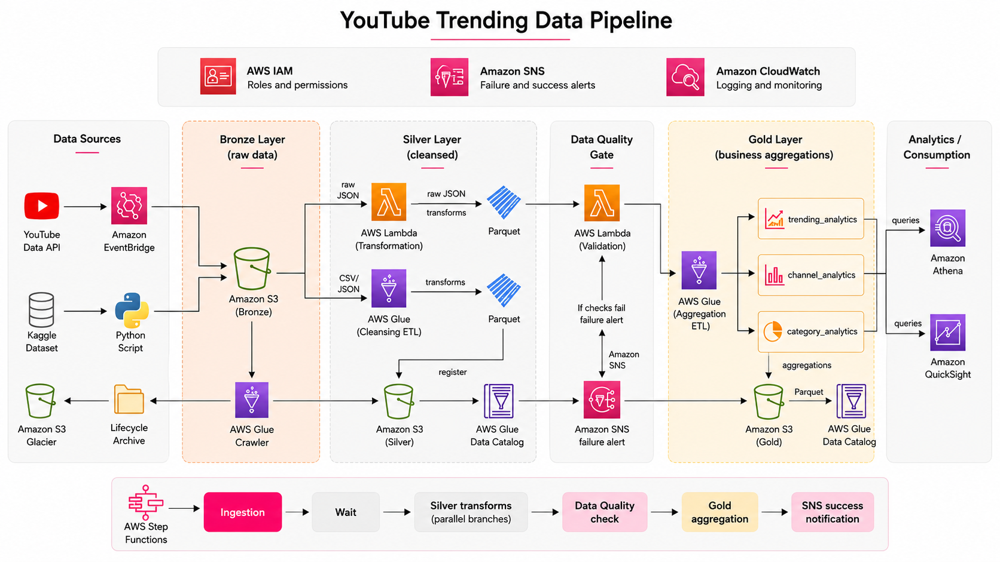
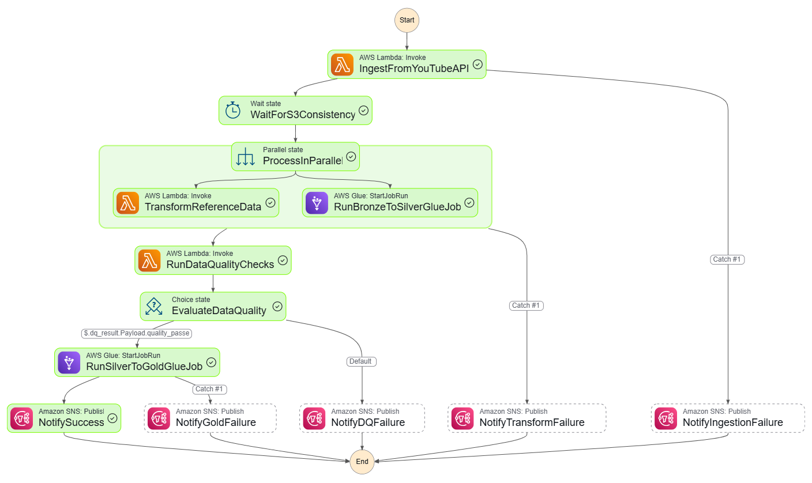
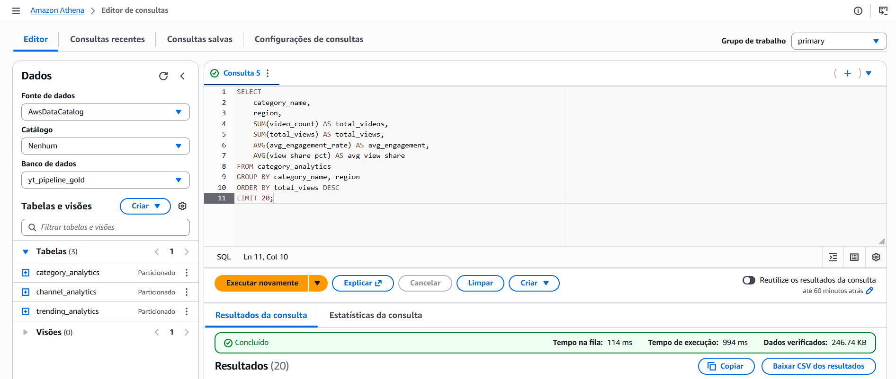

# YouTube Trending Data Pipeline


End-to-end data engineering project on AWS that ingests YouTube trending video data, stores it in a data lake, applies ETL and data quality controls, and publishes analytics-ready datasets for SQL exploration and dashboarding.

The project was built to demonstrate production-oriented data engineering practices: serverless ingestion, Medallion Architecture, PySpark transformations, cataloged Parquet datasets, data quality gates, orchestration, monitoring, and analytical data modeling.

## Table of Contents

- [Project Overview](#project-overview)
- [Architecture](#architecture)
- [Data Flow](#data-flow)
- [Data Layers](#data-layers)
- [Data Quality](#data-quality)
- [Orchestration](#orchestration)
- [Analytics](#analytics)
- [AWS Services](#aws-services)
- [Project Structure](#project-structure)
- [How to Run](#how-to-run)
- [Business Questions](#business-questions)
- [Engineering Highlights](#engineering-highlights)

## Project Overview

This pipeline processes YouTube trending video data from two types of sources:

- Live ingestion from the YouTube Data API v3.
- Historical regional CSV and category JSON files based on Kaggle-style datasets.

The data is organized using the Medallion Architecture pattern:

| Layer | Purpose | Output |
| --- | --- | --- |
| Bronze | Raw landing zone for API and historical files | Original JSON/CSV data stored in S3 |
| Silver | Cleaned, standardized, deduplicated data | Parquet tables partitioned by region and registered in Glue Catalog |
| Gold | Business-level aggregations | Query-ready analytical tables for Athena and QuickSight |

The final Gold datasets support analysis by region, category, channel, engagement, views, likes, comments, and trending behavior over time.

## Architecture



The solution combines managed and serverless AWS services to create an automated analytics pipeline:

- AWS Lambda ingests live data from the YouTube API and processes reference JSON files.
- Amazon S3 stores raw, cleaned, and curated datasets across Bronze, Silver, and Gold layers.
- AWS Glue and PySpark perform scalable ETL transformations.
- AWS Glue Data Catalog exposes tables for downstream querying.
- AWS Step Functions orchestrates the full workflow and handles failure branches.
- Amazon SNS sends success and failure notifications.
- Amazon CloudWatch provides logs and operational visibility.
- Amazon Athena enables serverless SQL analytics.
- Amazon QuickSight can be connected to Gold tables for dashboards.

## Data Flow

```text
YouTube Data API / Historical CSV and JSON files
        |
        v
AWS Lambda ingestion and S3 upload
        |
        v
Amazon S3 - Bronze layer
        |
        v
AWS Lambda + AWS Glue transformations
        |
        v
Amazon S3 - Silver layer
        |
        v
Data Quality Lambda
        |
        +-- Failed -> Amazon SNS alert and pipeline stop
        |
        v
AWS Glue Gold aggregation
        |
        v
Amazon S3 - Gold layer
        |
        v
AWS Glue Data Catalog
        |
        v
Amazon Athena / Amazon QuickSight
```

## Data Layers

### Bronze Layer

The Bronze layer stores source data as close as possible to its original format.

Sources include:

- YouTube trending videos from the YouTube Data API.
- Video category metadata by region.
- Historical regional CSV files.
- Historical category reference JSON files.

The ingestion Lambda writes live API responses to S3 using Hive-style partitions such as:

```text
youtube/raw_statistics/region=us/date=YYYY-MM-DD/hour=HH/<ingestion_id>.json
youtube/raw_statistics_reference_data/region=us/date=YYYY-MM-DD/us_category_id.json
```

### Silver Layer

The Silver layer standardizes and cleans the raw data into analytics-friendly Parquet datasets.

Main responsibilities:

- Read raw statistics from the Bronze Glue Catalog.
- Support both historical CSV data and live API JSON data.
- Enforce schema and data types.
- Standardize region codes and dates.
- Remove invalid records and duplicates.
- Fill missing numeric metrics where appropriate.
- Create derived metrics such as `like_ratio` and `engagement_rate`.
- Write Parquet data to S3 partitioned by `region`.
- Register or update Glue Catalog tables.

Current regional scope:

- The Bronze to Silver Glue job currently processes the four regions used in this execution: `ca`, `gb`, `us`, and `in`.
- Historical files for other regions are kept in the repository as sample/source data, but they are not included in the current Bronze to Silver filter unless the job predicate is expanded.
- The Silver statistics output is partitioned by `region`; the parsed trending date is stored as a column used for deduplication and analytics, not as an S3 partition key.

Main components:

```text
Glue_jobs/bronze_to_silver_statistics.py
Lambdas/json_to_parquet/lambda_function.py
```

### Gold Layer

The Gold layer contains curated business tables optimized for Athena queries and dashboard consumption.

Gold tables produced by `Glue_jobs/silver_to_gold_analytics.py`:

| Table | Description |
| --- | --- |
| `trending_analytics` | Daily trending summaries by region, including total videos, views, likes, comments, engagement, unique channels, and categories. |
| `channel_analytics` | Channel-level performance metrics by region, including total videos, views, engagement, ranking, and trending window. |
| `category_analytics` | Category-level trends by region and date, including video count, total views, engagement, unique channels, and view share. |

## Data Quality

Before the Gold layer is built, the pipeline runs a dedicated Data Quality Lambda over the Silver tables.

Implemented checks include:

- Minimum row count validation.
- Critical-column null percentage validation.
- Schema validation for expected columns.
- Numeric range checks for metrics such as views.
- Freshness validation based on processing timestamps when available.

If checks fail, the pipeline sends an SNS notification and does not execute the Gold aggregation job.

```text
Silver tables
    |
    v
Data Quality Lambda
    |
    +-- Passed -> Continue to Gold aggregation
    |
    +-- Failed -> Send SNS alert and stop workflow
```

## Orchestration

The pipeline is orchestrated with AWS Step Functions.



Workflow stages:

```text
Start
  |
  v
IngestFromYouTubeAPI
  |
  v
WaitForS3Consistency
  |
  v
ProcessInParallel
  |-- TransformReferenceData
  |-- RunBronzeToSilverGlueJob
  |
  v
RunDataQualityChecks
  |
  v
EvaluateDataQuality
  |-- Passed -> RunSilverToGoldGlueJob -> NotifySuccess
  |-- Failed -> NotifyDQFailure
```

The state machine includes retries and dedicated failure notifications for ingestion, transformation, data quality, and Gold aggregation failures.

## Analytics

Gold tables are queried with Amazon Athena and can be consumed by BI tools such as Amazon QuickSight.



Example query:

```sql
SELECT
    category_name,
    region,
    SUM(video_count) AS total_videos,
    SUM(total_views) AS total_views,
    AVG(avg_engagement_rate) AS avg_engagement,
    AVG(view_share_pct) AS avg_view_share
FROM category_analytics
GROUP BY category_name, region
ORDER BY total_views DESC
LIMIT 20;
```

## AWS Services

| Service | Role in the Project |
| --- | --- |
| Amazon S3 | Data lake storage for Bronze, Silver, Gold, and Athena query results. |
| AWS Lambda | API ingestion, reference JSON transformation, and data quality validation. |
| AWS Glue | Distributed ETL jobs using PySpark. |
| AWS Glue Data Catalog | Metadata catalog for Silver and Gold datasets. |
| AWS Step Functions | Workflow orchestration, retries, branching, and failure handling. |
| Amazon EventBridge | Scheduled execution trigger for the pipeline. |
| Amazon SNS | Success and failure notifications. |
| Amazon CloudWatch | Logs and operational monitoring. |
| Amazon Athena | Serverless SQL analytics over cataloged Parquet tables. |
| Amazon QuickSight | Optional dashboard and visualization layer. |
| AWS IAM | Service roles and least-privilege permissions for pipeline components. |

## Project Structure

```text
YOUTUBE-DATA-PIPELINE/
|
|-- Data/
|   |-- *videos.csv
|   |-- *_category_id.json
|
|-- Data_quality/
|   |-- dq_lambda.py
|
|-- Glue_jobs/
|   |-- bronze_to_silver_statistics.py
|   |-- silver_to_gold_analytics.py
|
|-- Iam_permissions/
|   |-- yt-data-pipeline-glue-role.json
|   |-- yt-data-pipeline-lambda-role.json
|   |-- yt-data-pipeline-stepfunctions-role.json
|
|-- Lambdas/
|   |-- json_to_parquet/
|   |   |-- lambda_function.py
|   |-- yt_api_ingestion/
|       |-- lambda_function.py
|
|-- Scripts/
|   |-- aws_cli_copy.sh
|   |-- information.md
|
|-- Step_functions/
|   |-- pipeline_orchestration.json
|
|-- imgs/
|   |-- Athena_query.png
|   |-- stepfunctions_graph.png
|   |-- YouTube_trending_data_pipeline.png
|
|-- README.md
```

## How to Run

This repository contains the source code and AWS configuration artifacts used to deploy the pipeline components. The exact deployment may vary by AWS account, region, bucket naming convention, and IAM setup.

High-level setup steps:

1. Create the S3 buckets for Bronze, Silver, Gold, and Athena query results.
2. Create the Glue databases for Bronze, Silver, and Gold layers.
3. Configure IAM roles using the policy references in `Iam_permissions/`.
4. Deploy the Lambda functions from `Lambdas/` and `Data_quality/`.
5. Create the Glue jobs using the scripts in `Glue_jobs/`.
6. Configure the Step Functions state machine using `Step_functions/pipeline_orchestration.json`.
7. Configure environment variables such as:

```text
YOUTUBE_API_KEY
S3_BUCKET_BRONZE
S3_BUCKET_SILVER
SNS_ALERT_TOPIC_ARN
ATHENA_OUTPUT_S3
ATHENA_WORKGROUP
GLUE_DB_SILVER
GLUE_TABLE_REFERENCE
YOUTUBE_REGIONS
```

For the execution represented by this repository, the main statistics transformation is scoped to `ca`, `gb`, `us`, and `in`.

8. Run the Step Functions workflow manually or schedule it with EventBridge.
9. Query the Gold tables in Athena or connect them to QuickSight.

Security note: API keys, account IDs, ARNs, and bucket names should be handled as environment-specific configuration and should not be hardcoded in reusable documentation.

## Business Questions

The Gold layer can help answer questions such as:

- Which video categories generate the highest engagement by region?
- Which channels appear most frequently in trending lists?
- Which regions generate the highest volume of trending videos?
- How do views, likes, and comments vary across regions and categories?
- Which categories dominate total view share over time?
- Which channels or categories show abnormal spikes in performance?

## Engineering Highlights

This project demonstrates hands-on experience with:

- AWS-based data engineering.
- Data lake design with Bronze, Silver, and Gold layers.
- Serverless ingestion from external APIs.
- Batch ETL with AWS Glue and PySpark.
- Parquet optimization and partitioned datasets.
- Glue Data Catalog integration.
- Data quality validation before analytical publishing.
- Workflow orchestration with Step Functions.
- Error handling, retries, and SNS notifications.
- SQL analytics with Athena.
- IAM role design for AWS data pipelines.
- Modular project organization suitable for portfolio review.

## Repository Status

This is a portfolio data engineering project focused on demonstrating the design and implementation of a cloud-native analytics pipeline. It includes source code, orchestration definitions, IAM references, sample historical data, and screenshots from the AWS analytics workflow.
